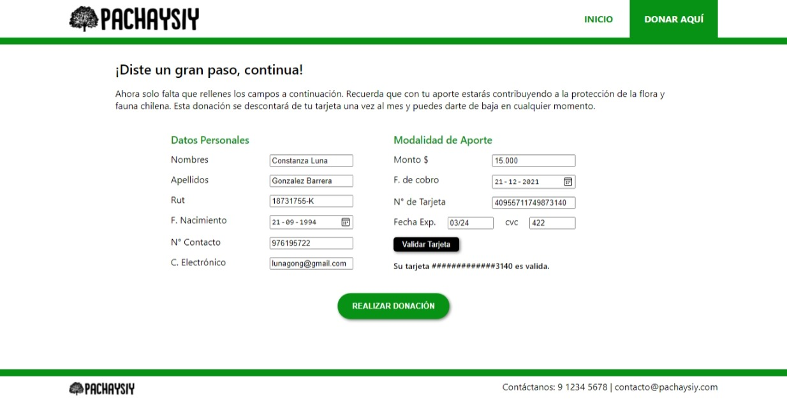

# PACHAYSIY

## Proyecto de Card Validation

Aplicación Web para ingresar donaciones monetarias a Parques, Reservas y Monumentos Nacionales.

## Imagen final del proyecto.

## Investigación UX

### - ¿Quiénes son los principales usuarios del producto?
Un público que tiene interés en la naturaleza y se preocupa por la protección de la flora y fauna. Habitualmente son personas que estan o les gusta estar constantemente en estos lugares. Pueden ser hombres y mujeres de un rango promedio entre 20 a 50 años.

### - ¿Cuáles son los objetivos de estos usuarios en relación con tu producto?

Aportar monetariamente de forma rápida y sencilla a que estos parques y reservas se mantengan en buen estado.

### - ¿Cómo crees que el producto que estás creando está resolviendo sus problemas?

La mayoría de estas personas estan siempre pendientes y preocupadas por los sectores en los que les gusta transitar, y a veces cuando ven algo en mal estado o que otras personas pasan a llevar, se sienten frustrados por no poder ayudar mucho. Esta solución web generará una mayor tranquilidad al usuario para que pueda aportar de su propio bolsillo a la seguridad y mantención de estas zonas que tanto le importan, sólo haciendo unos click's en su smartphone u ordenador, desde la comodidad de su hogar.

### - Prototipo en papel:

### - Feedback recibido:

Mis compañeras me sugirieron: sacar la página de contacto ya que en el footer ya salia esta información; que debia enfocarme más en la sección de validación; podría agregar los campos de "fecha de expiración" y "codigo CVC" de la tarjeta; simplificar más la página de donación, no tener miedo a sacar contenido de la página si esque me encontraba en problemas y que probara utilizar Figma porque se podia generar cierta interacción con las páginas y esto iba a mostrarme un vista más real de lo que estaba buscando.

### - Prototipo final:

Prototipo interactivo de Figma: https://www.figma.com/proto/0e48jyAst2LYiuSUjtnFOH/Card-Validation-Pachaysiy?node-id=26%3A352&scaling=min-zoom&page-id=26%3A307&starting-point-node-id=26%3A352

